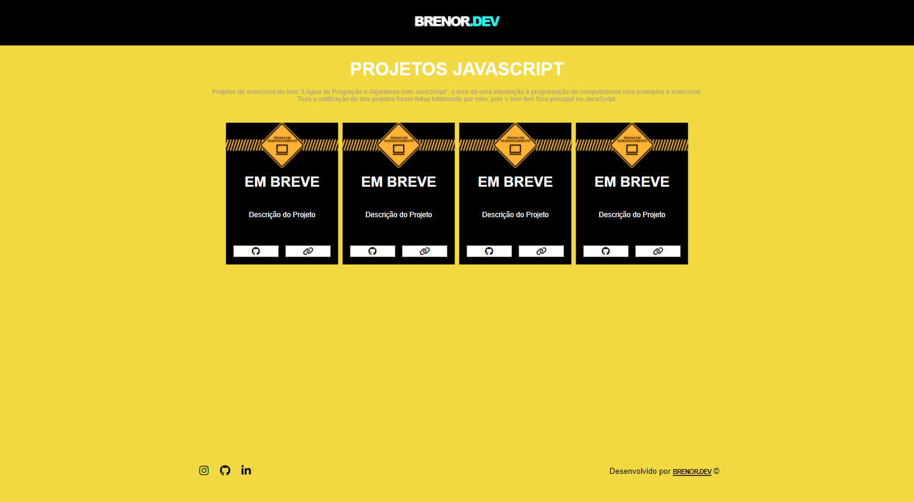
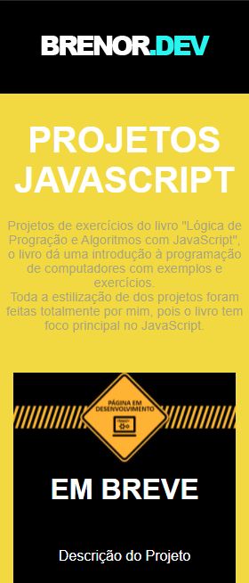
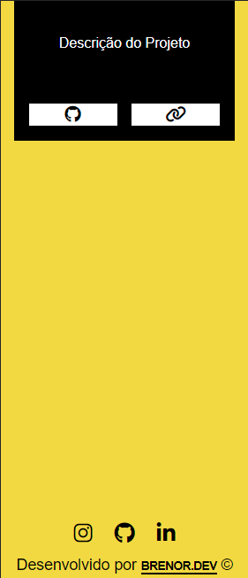

## Projetos JavaScript

Projetos de exercícios do livro "Lógica de Progração e Algoritmos com JavaScript", o livro dá uma introdução à programação de computadores com exemplos e exercícios.

## Link do projeto

Link: https://projetosjavascript.netlify.app/

## Stack utilizadas

  
  
  

## Screenshots

